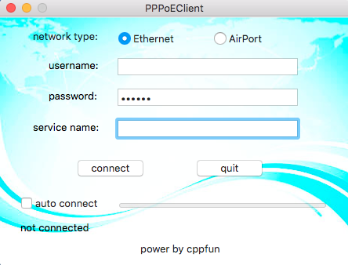

# mac-pppoe
Mac osx pppoe客户端，支持有线和无线两种方式；
如果你本地已经有你选择的连接类型的pppoe服务，那么程序只会直接调用它，而不会创建它；
如果本地不存在你选择的连接类型服务，程序会帮你自动创建一个pppoe类型的连接。

## 目录
1. 应用程序图标
2. 应用程序更新
3. 应用程序背景图
4. 国际化
5. 程序逻辑部分
6. 后期维护
7. 开发版本
8. quit更新

## 内容

### 1. 应用程序图标
PPPoEClient.icns 这个你们可以自己修改，只要名字不变就可以。
128 × 128 pixels

### 2. 应用程序更新
这个在pppoeGUI中。

#### 2.1 常量
```objc
const NSString *curl=@"http://dev.cppfun.com/pppoe.txt";
const int ccurrVesion=1;
```

#### 2.2 函数
```objc
- (void)checkUpdate:(const NSString *)url version:(int)currVesion;
```

#### 2.3 调用
我把它放在pppoe连接成功后的位置进行后台异步检查
特殊说明：
// osx can make the app with 32bit and 64bit together
// so we do need the Ostype request field on osx
// http://dev.cppfun.com/pppoe.txt?CurrVersion=1
我这里是模拟的response string

```objc
// here do some update check
[self checkUpdate:curl version:ccurrVesion];
```

### 3. 应用程序背景图
background.jpg
这个名字和类型不要变。图片大小：465 × 329 pixels
你们可以直接替换该图片来修改应用程序背景。

### 4. 国际化
目前应用程序分为中、英双版
Localizable.strings里面有chinese和english
注意里面的格式（以分号结束）：
```objc
"updateLabel" = "A new version find.";
"updateLabel" = "发现一个新版本.";
```

### 5. 程序逻辑部分
基于cocoa典型mvc模式，另外有线程切换在里面，还有本地服务读取和权限设置与读取。
你们可以不需要懂得每一行代码，只需要让代码跑起来能调试和修改我觉得这个问题不大。

### 6. 后期维护
略过

### 7. 开发版本
* OSX Version 10.11.1 (15B42) 64-bit；
* xcode Version 7.2 (7C68); 

### 8. quit更新
主要更新pppoeGUI.m - (IBAction)qButtonAction:(id)sender;

```objc
- (IBAction)qButtonAction:(id)sender {
    // update for cancel begin
    if (queue) [queue cancelAllOperations];
    if (tStatus == kDisconnectTitle || tStatus == kCancelTitle) {
        [self addOperation:kPPPDisconnect];
    }
    // update for cancel endl
	[[NSApplication sharedApplication] terminate:sender];
}
```

License
-

MIT

*http://www.cppfun.com*